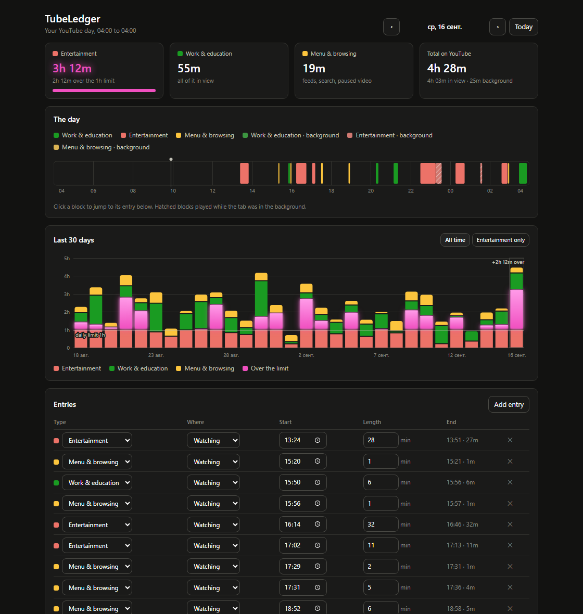
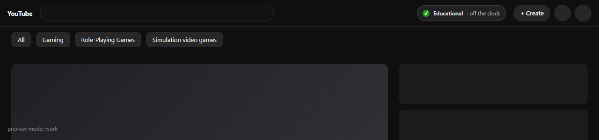
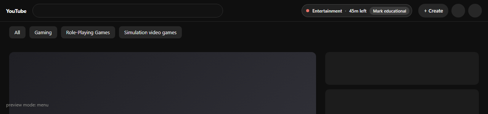
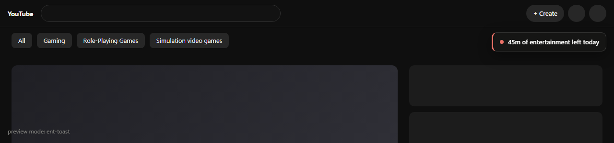

# TubeLedger

A Chrome extension that keeps an honest ledger of your YouTube hours — how much
was **work & education**, how much was **entertainment**, and how much was just
scrolling the menus — and stops entertainment at a daily limit you set.

Built for one user (me). No account, no server, no telemetry: everything lives in
`chrome.storage.local` on this machine.



## What it counts, and what it refuses to count

The day runs **04:00 → 04:00**, so a late night stays on the evening it belongs to.

| What is happening | Counted as | Colour |
|---|---|---|
| Video playing, tab in front | the tab's category | green (work) / red (entertainment) |
| Browsing, searching, or a paused video, tab in front | menu time | yellow |
| Video playing, tab hidden or window unfocused | the same category, flagged *background* | muted + 45° hatch |
| Tab hidden with nothing playing | **nothing** | — |
| No input for a while (idle) while browsing | **nothing** — but a running video keeps counting | — |
| Screen locked | demoted to background | muted + hatch |

Two rules hold the whole thing together:

- **Only one thing is counted at a time.** With three tabs playing, one of them is
  billed — so the ledger can never add up to more than the clock did.
- **What you are looking at beats what is merely audible.** A front tab playing
  wins over a background tab playing.

Hover previews on the home feed (muted autoplay) don't count as watching; a muted
video on a `/watch` or `/shorts` page does.

## The daily limit

Default **60 minutes of entertainment**. When it's spent, playback pauses on any
tab marked *entertainment* and an overlay says so. Work & education is never
blocked, and menu time is never blocked.

The only one-click escape is "this is work & education" — for when something was
miscategorised. Anything else means opening the dashboard and changing the limit
on purpose, which is the point.

The toolbar badge counts the remaining entertainment minutes down: green, then
amber under ten minutes, then red at zero.

## The header indicator

YouTube's own header gets a pill, docked next to Create and the bell — real header
space, so it never covers a thumbnail, a video or the filter chips. It says a
different thing depending on what you are doing:

**Watching work & education** — a quiet green tick, always there, so you can stop
wondering whether the clock is running.



**Anywhere that isn't playing — feeds, search, a paused video** — the explicit
bar: which mode this tab is in, what is left of today's budget, and a button to
switch mode without opening the popup.



**Watching entertainment** — nothing stands in the way. Instead a reminder slides
into the corner below at each round figure of budget left (55m, 50m, 45m …) and
fades after seven seconds. The step is configurable, or off.



Where there is no header to dock into — fullscreen, or if YouTube rearranges its
markup — the pill falls back to a floating card in the top-right corner. It stays
out of the way when the limit overlay is up, and can be switched off entirely in
Settings.

## Categories

Each YouTube **tab** carries a category. New tabs start at whatever
`New tabs count as` says (default: entertainment — the strict choice). The popup
flips the current tab between work and entertainment in one click, and so does
the button on the corner bar. A tab left uncategorised books its time as yellow,
not as entertainment.

## Editing the record

Every entry on the dashboard can be re-typed, moved between *watching* and
*background*, re-timed, re-lengthed, or deleted, and you can add entries by hand
for time the tracker missed. **Only the type and the length are ever stored** —
never a video title, a channel, or a URL. The tracker keeps no history of what you
watched, only of what kind of time it was.

## Install

1. `git clone https://github.com/AlexanderMishutkin/tubeledger.git`
2. Open `chrome://extensions`, turn on **Developer mode**
3. **Load unpacked** → pick the cloned folder
4. Pin the icon; open the popup to check it's counting

Unpacked extensions don't auto-update — `git pull` and hit reload on
`chrome://extensions` when you want the newer code.

## Permissions, and why each one is there

| Permission | Why |
|---|---|
| `storage` | the ledger and the settings, local only |
| `alarms` | a one-minute heartbeat so the worker closes an open session after the last YouTube tab goes away |
| `idle` | to stop counting menu time when you walk away |
| `*://*.youtube.com/*` | the content script that reports play/pause and pauses playback at the limit |

There is no `tabs` permission: the extension never reads a tab's URL or title. It
learns only what each content script reports about its own page — playing or not,
a video page or not, visible or not, focused or not.

No `fetch`, no `eval`, no `innerHTML`, no remote code, no `storage.sync`. Nothing
leaves the browser. `test/preview*.html` are dev harnesses that do use `fetch` to
load the real pages — they are not part of the extension.

## Layout

```
manifest.json
src/
  background.js     service worker: the accounting engine
  content.js        reports tab state, pauses playback at the limit
  popup.html/js/css today at a glance, category switch
  dashboard.html/…  timeline, 30-day history, entry editing, settings
  lib/
    decide.js       the one rule that picks what the clock runs on
    model.js        days, segments, totals — pure, no chrome.*
    store.js        chrome.storage.local wrapper
    charts.js       hand-rolled SVG charts
    theme.css       palette and shared styles
scripts/make-icons.mjs   generates icons/*.png from code
test/                    node --test suites + browser preview harnesses
docs/                    screenshots
```

## Development

```sh
npm test                 # 32 tests: the model, the decision rule, the engine end-to-end
npm run icons            # regenerate icons/*.png
npm run preview          # then open http://localhost:8777/test/preview.html
```

`test/engine.test.mjs` runs the real service worker against a stubbed `chrome.*`
and a fake clock, so the counting rules are checked without a browser.
`test/preview.html` and `test/preview-popup.html` render the real pages against
seeded data, and `test/preview-hud.html?mode=work|ent-toast|menu|blocked` renders
the corner indicator over a mock YouTube — all three for looking at the UI without
loading the extension.

## Colours

The palette is checked, not eyeballed: green/amber/red with a large enough
lightness spread that the pairs stay apart under red-green colour blindness
(worst-pair ΔE 14.7 light, 8.5 dark, against a ≥8 target), in both light and dark
themes. Background playback is the muted step of the same hue **plus a 45° hatch**,
so foreground and background never rest on colour alone. Every colour is also
labelled in the legend, the tooltips and the entries table.

## Known limits

- Chrome/Chromium, Manifest V3. Not tested on Firefox.
- Tab categories live in session storage: they survive a service-worker restart,
  but reset when Chrome fully closes.
- The indicator's clock ticks in whole minutes and updates every few seconds, so
  a reminder can land a few seconds after the exact figure.
- Docking into the header means reading YouTube's markup (`ytd-masthead #buttons`)
  — the one piece of the extension coupled to their DOM. If it changes, the pill
  re-appears as a floating card rather than disappearing; nothing else is affected.
  On a narrow window the pill sheds its label, then its button, to leave YouTube's
  own controls room.
- A sleeping machine or a suspended worker leaves a gap of up to a few seconds
  unbilled at each end. That is deliberate — a gap is never billed.
- Editing a day that is still in progress discards at most the last few seconds of
  the session in flight.

## License

MIT — see [LICENSE](LICENSE).
